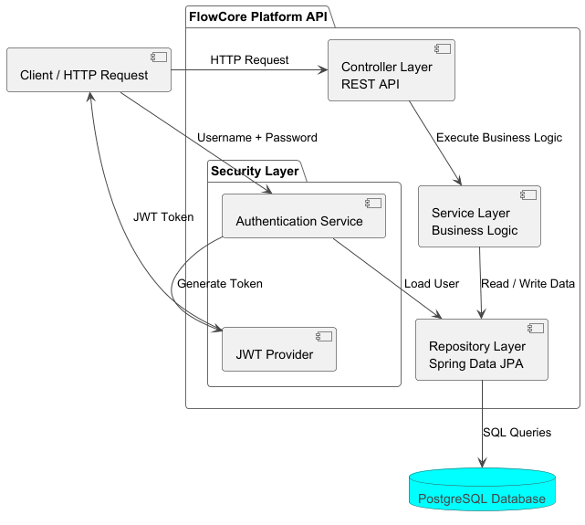

# Flowcore Platform

Backend REST API application built with **Java** and **Spring Boot**.

The project demonstrates modern backend development practices including REST API design, JWT authentication, role-based
authorization, database migrations, validation, exception handling, and integration testing.

---

# Features

- User management
- Task management
- User-task relationship
- JWT authentication
- Role-based authorization
- Soft delete support
- DTO validation
- Global exception handling
- Database migrations with Liquibase
- PostgreSQL database
- OpenAPI documentation
- Docker support
- Integration testing

---

# Technology Stack

## Backend

- Java 21
- Spring Boot
- Spring MVC
- Spring Security
- Spring Data JPA
- Hibernate ORM
- MapStruct

## Database

- PostgreSQL
- Liquibase

## Security

- JWT Authentication
- Role-based access control

## Testing

- JUnit 5
- Mockito
- AssertJ
- MockMvc
- REST Assured
- Testcontainers

## Tools

- Maven
- Docker
- Docker Compose

---

# Architecture

The application follows a layered architecture:

```

Controller
|
Service
|
Repository
|
Database

```

Main project modules:

```

controller
dto
entity
repository
service
security
exception
mapper
configuration

```

---

# Database

The database schema is managed using **Liquibase**.

Database initialization includes:

- table creation
- relationships
- constraints
- initial test data

Main entities:

```

User
|
| 1:N
|
Task

```

A user can have multiple tasks assigned.

---

# Security

The application uses JWT authentication.

Authentication flow:

1. User sends username and password.
2. Credentials are validated.
3. JWT token is generated.
4. The token is used for accessing protected endpoints.

Authorization is implemented using roles:

```

ROLE_USER
ROLE_ADMIN

```

---

# API Documentation

Interactive API documentation is available through Swagger UI:

```

http://localhost:8080/swagger-ui/index.html

````

Controllers are documented using OpenAPI annotations:

- API descriptions
- request parameters
- response codes
- validation errors

---

# Testing

The project contains different testing approaches.

## Controller Integration Tests

### MockMvc

Tests Spring MVC controllers using the application context.

Covered scenarios:

- HTTP requests
- validation
- security
- response status
- JSON response validation

### REST Assured

Tests REST API endpoints through real HTTP requests.

Covered scenarios:

- authentication flow
- authorization
- CRUD operations
- API responses

---

# Environment Configuration

The application uses environment variables for database and security configuration.
Create `.env` file based on the provided example:

```bash
cp .env.example .env
````

Example variables:

```
POSTGRES_DB
POSTGRES_USER
POSTGRES_PASSWORD
JWT_SECRET
JWT_EXPIRATION
```

The `.env` file contains local configuration and should not be committed to the repository.

---

# Running the Project

## Requirements

* Java 21+
* Docker
* Maven

## Start PostgreSQL

```bash
docker compose up -d
```

## Run application

```bash
mvn spring-boot:run
```

Liquibase will automatically apply database migrations during application startup.

---

# Demo Authentication Accounts

Initial users are created automatically during database initialization using Liquibase migrations.
The username values should be taken from the initialized database records.
Passwords for local API testing:

## Administrator

Role:

```
ROLE_ADMIN
```

Password:

```
admin
```

## User

Role:

```
ROLE_USER
```

Password:

```
user
```

Passwords stored in the database are encrypted using BCrypt.
Original passwords cannot be retrieved from database hashes.

---

## Architecture

